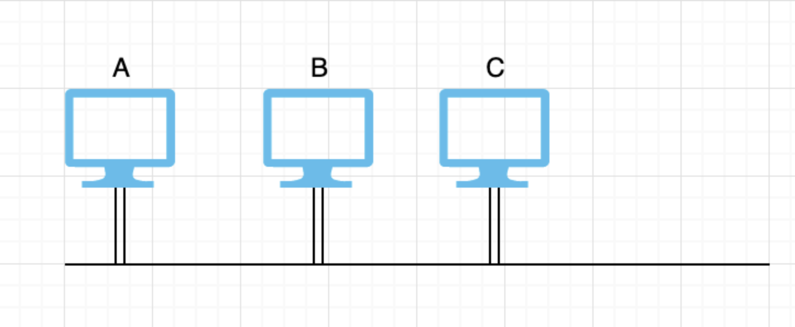
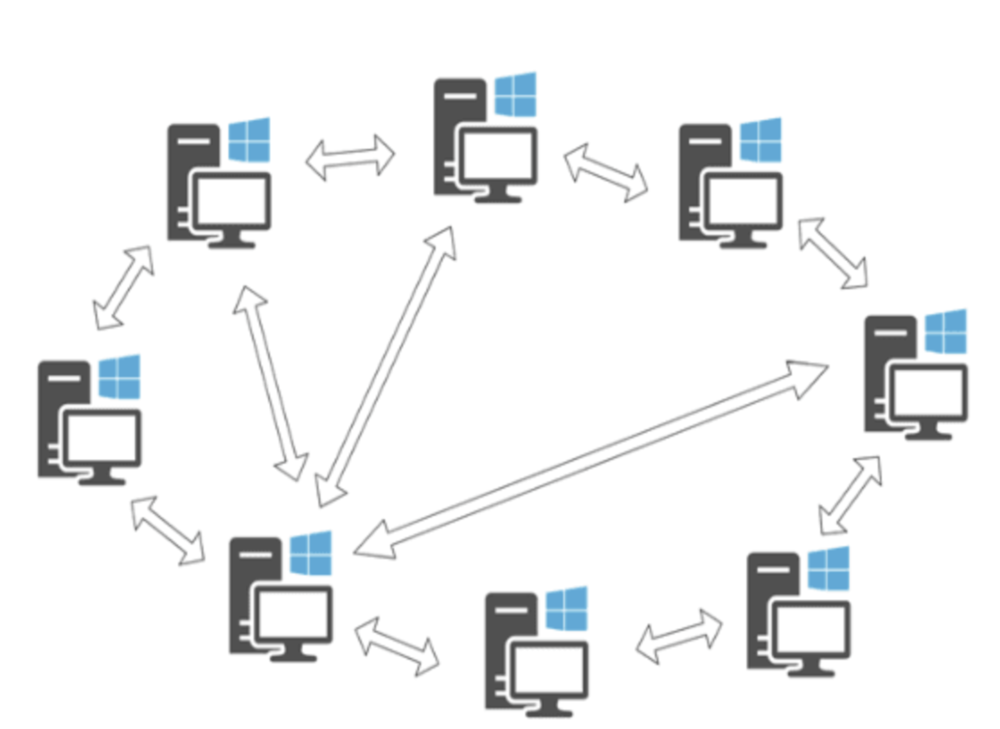

# Redes de computadores
- Hardware
- Software

### Um computador precisa de
- Um processador

## Hardware
### Tecnologias de Transmissão
- Broadcast
- Ponto a ponto

### Medidas

Bits por segundo

### Broadcast

- Compartilhamento do meio de comunicação
- Quando enviam um pacote, continuam escutando.
- Um único canal de comunicação é utilizado para todas comunicações transmitirem, e existe o problema de colisão de pacotes. Colisão existe por que todos utilizam o mesmo caminho.

É preciso fazer
- Controle de pacote ( Controle de colisão )

Exemplos
- Rede local com Hub ( LAN )
- T de uma tomada elétrica
- Rede local wireless ( WLAN ) (todos disputam o mesmo meio)

### Ponto a ponto

- Canal de comunicação exclusiva entre dois computadores ( qualquer dispositivo com processamento )
- Os dados passam pelas máquinas intermediárias para chegar ao destino final
- Sempre será escolhido o melhor caminho, que é o caminho mais curto. Nem sempre o mais curto é o com o menor número de dispositivos.
- Não há problemas de colisão.

É preciso fazer
- Controle de fluxo: Evita que a fonte envie dados muitos rápidos e o destino não envie dados muito rápido

Exemplos
- Rede local com switch (decide qual porta enviar)
- Redes WAN ( Internet )

## Canais
- `Simplex` Utiliza dois cabos. Um cabo não consegue transmitir ida e volta, apenas transmite em um sentido
- `Half Duplex` Transmite ambos os lados (ida e volta) mas não é simultaneao, há uma transmissão por vez
- `Full Duplex` Há a transmissão dos dois lados simultaneamente

### Backbone
Estrutura principal de uma rede

# Escala da Rede
- LAN ( Local area network ) - Switches & hubs - Alcance máximo alguns KMs dentro de um mesmo terreno
- MAN ( Metropolitan area network ) - Utiliza tecnologia lan - Alcance de vários KMs
- WAN ( Wide area network ) - Pontos são conectados com roteadores - Alcance mundial

Sem Fio ( Wireless )
- WPAN ( personal )
- WLAN
- WMAN
- WWAN

# Software
Software -> Formado por arquiteturas de rede

### `OSI`
Open System Interconnection: Primeiro padrão desenvolvido que possibilita que qualquer computador de qualquer fabricante possa se conectar a rede.  

7 Camadas:
- Aplicação
- Apresentação
- Sessão
- Transporte
- Rede
- Enlace
- Física

### `TCP/IP`
5 Camadas:
- Aplicação
- Transporte
- Rede
- Enlace
- Física

### `ATM`
3 Camadas:
- AAL
- ATM
- Física
