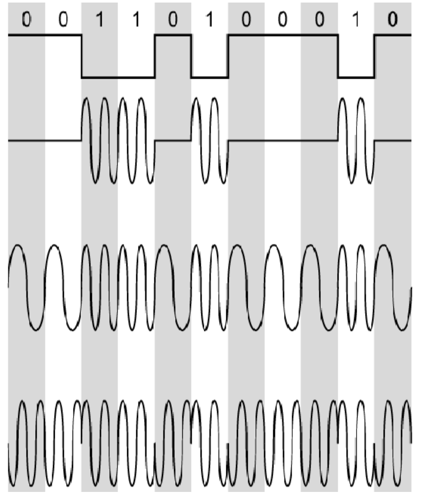

# Modulação e Codificação

# Modulação do Sinal
MoDem = Modulation | Demodulation

A modulação converte dados digitais em sinais analógicos

1. Bits
2. Modulação por amplitude
3. Modulação por frequencia
4. Modulação por fase

# Modulação em Quadratura

União de amplitude e fase
QAM - Geral sinal analógico e gera também sinal digital.

# Codificação

Converte Dado Digital em Sinal Digital.
Serve para adaptar, para que o sinal possa ser transmitido mais longe, mesmo que não mude o tipo de sinal.

## Técnicas de Codificação
- `NRZ-L` (Não retorno ao 0)
- `NRZ-I` (Não retorno ao 0 invertido)
- `Manchester` (Utilizada na primeira ethernet)
- `Manchester Diferencial`

Para Converter Dados Analógicos para Sinais Digitais
- `PCM` Pulse Code Modulation (Utiliza um codificador - Codec)
- `DM`

### PCM
1. Amostragem
2. Quantização
3. Codificação

# Resumindo
Os sinais digitais sofrem mais atenuação que os sinais analógico, pois os sinais digitais tem uma amplitude menor.
É preciso converter o sinal para que ele possa ser transmitido em uma distância maior, utilizando modulação de sinal, codificação, ou pcm.

# Multiplexação

Divir um canal em mais canais para ter transmissões simultâneas.

## Por frequência (FDM)
Aloca frequências menores para diferentes canais

Ex: ADSL - Assimetric, downstream channel is bigger ( 1 de voz, 1 downstream, 1 upstream )

## Por fatias de tempo (TDM)

- `Síncrona` Uma fatia de tempo é alocada ao dispositivo, tendo ou não dados para ser transmitidos. Pode gerar ociosidade de transmissão no canal.
- `Assíncrona/Estatística` Quando o computador não tem nada a transmitir, passa para o próximo. Não gera ociosidade.

Ex: Rede Local

## Por tamanho da onda de luz (WDM)
Separa pelo comprimento de onda (cor). Utilizado na fibra ótica.

# Comutação

Definir a reserva de recursos na rede na hora da transmissão dos dados.

### `Circuito`
Não ocorre congestionamento durante a transmissão.
Etapas:
1. Estabelecimento de conexão
2. Transferência de Dados
3. Encerramento de conexão

### `Pacote`
Tipo cartas do Sedex. Talvez chegue, ordem não é mantida, etc.
