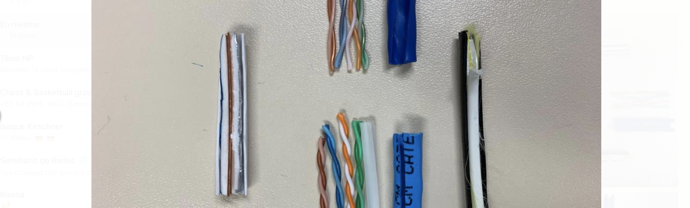

# Eletricidade
- Taxa de fluxo medida em **ampère** = 1 coulomb = 6.25 bilhões de bilhões de elétrons
- Resistência elétrica medida em **ohms**
- Ampères = Volts / Ohms
- Quanto maior o cabo, maior a resistência

# Coaxial
- Malha de alumínio, folha de alumínio e capa plástica

# Par trançado
- Ele é trançado justamente para aumentar o cancelamento de um cabo pro outro, reduzir a interferência entre eles
- Cada par é um canal separado
- 2 pares para transmissão e 2 pares para recepção de dados
- Comunicação full duplex
- Ex: RJ45 (Ethernet)
- Podem ser Shielded Twisted Pairs (STP) ou Unshielded Twisted Pairs (UTP)

# Fibra ótica
- Uma para transmissão uma para recepção.
- Full duplex
