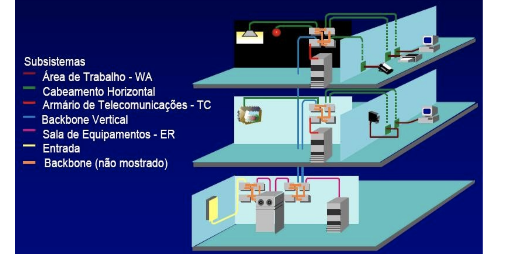

# Cabeamento estruturado

- `Backbone`: Estrutura principal da rede

## Diferença de um Hub e um Switch
O hub só implementa a camada física, portanto só distribui o sinal.
O Switch, implementa também a camada de enlace (pacote ethernet). Ele encaminha diretamente o dado para a porta aonde o destino da informação está conectado.

## Limitações
Caso a distancia dos cabos for maior que 100m, a atenuação é considerável. Nestes casos, é interessante adicionar um switch no meio do caminho ou fazer uma parte com fibra ótica e depois a distribuição.
