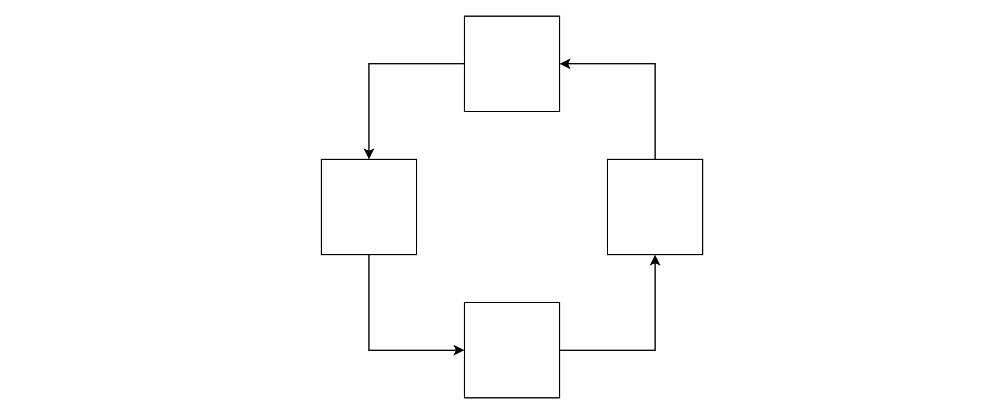
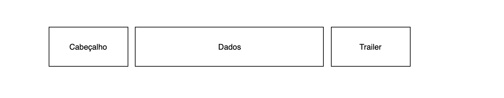

# Camada de Enlace

1. Controle de fluxo
2. Enquadramento
3. Acesso ao meio
4. Controle de erros

Nesta camada o pacote é chamado de quadro, ou frame.

### Cabeçalho do protocolo
Informações de controle no início de um quadro

## 1. Controle de Fluxo
Ocorre somente em redes ponto-a-ponto, _não_ acontece em redes Broadcast.

## 2. Enquadramento
Serve para delimitar o início e o final do quadro.

#### Métodos:
- `Sincronização`: É enviado alguns bytes entre as máquinas no inicio e começa a enviar quando estavam sincronizadas. Foi usada por pouco tempo pois as máquinas perdem rápido a sincronização.
- `Contagem de caracteres`: Se caracterizava por iniciar a transmissão com um número que indica a quantidade de caractere que vai ser enviada. Foi pouco utilizado pois o número inicial é sucetível a ruído e pode ser alterado.
- `Caracteres de Inicio e Fim com preenchimento`:
SOH - Start of Header
STX - Start of Text
ETX - End of Text
- `Bits de início e fim com preenchimento`
111111 - Uma sequência de bits que marca o início do quadro
111111 - Uma sequência de bits que marca o final do quadro

## 3. Acesso ao meio
- `Probabilístico`: Acessou o meio, e caso nada esteja sendo transmitido, ele transmite. É utilizado pelo broadcast pois no broadcast há um único meio de comunicação sendo disputado por todos.
- `Determinístico`: Passa um token dizendo que está livre, e quando uma máquina recebe um token dizendo que o meio está livre, ela pode tirar o token e passar dados, até que os dados chegem de volta nela, e ela por sua precisa então passar um token dizendo que está livre o meio.

## 4. Detecção e correção de erros
Serve para verificar se os dados enviados pela origem são os mesmos recebidos pelo destino (no caso se não houve alterações por ruído).

É aplicado um algoritmo sobre os dados, e os bit de verificação são aplicados no final dos dados, e antes do enquadramento final.

Ao detectar um erro, ele pode:
1. Detectar
2. Detectar e corrigir

## 4.1 Códigos de detecção de erros:

- Paridade par/ímpar
- Paridade combinada (Cycling Redundancy Check)
- Caracteres Código de Hamming

## `Paridade par/ímpar`
Utilizado em transmissões assíncronas. Nestes casos é transmitido um byte por vez, e é adicionado um bit de paridade no final de cada byte.
Na paridade par adiciona 0 quando o número de bits 1 é bar.
EX: 1000100 -> 1000100 + 1 -> 100100

## `Paridade Combinada`
Faz uma tabela com os bits enviado, e faz a paridade das linhas e colunas.

## `CRC`
Utiliza polinômio. Pega todos os bits e divide pelo polinômio gerador.
Coloca sempre os bits no final.

## `Código de Hamming`
Soma todos os bits com uma lacuna entre eles, seguindo uma sequência de potência de 2 até chegar no final da mensagem.
Coloca os bits de paridade no meio da mensagem.

Quem define o algoritmo? Aonde ele é enviado?
