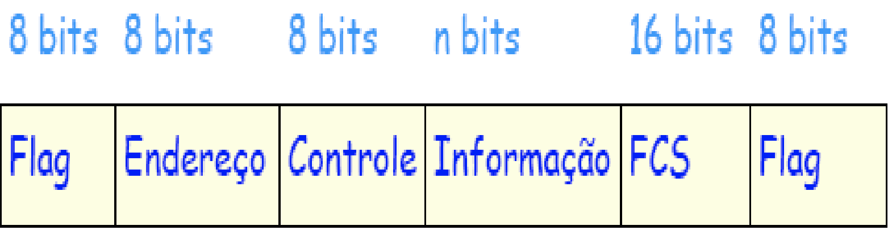
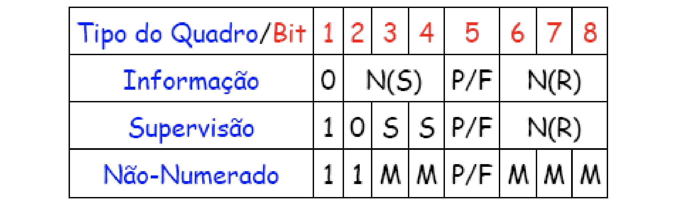
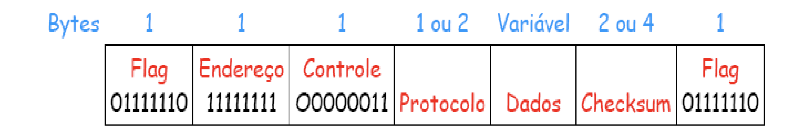

# Protocolos da camada de enlaçe

Protocolos
HDLC (High-Level Data Link)
PPP (Point-to-Point Protocol)
Ethernet metropolitana

## HDLC
Flag de início e final servem para fazer o enquadramento.
Os bits 01111110 são utilizados para fazer a Flag de início e final de quadro. Nos dados toda vez que tem 5 bits 1 seguido se adiciona um bit 0 depois, então quando se encontra 6 bits 1 seguidos significa que é o Flag de inicio ou final de enquadramento.
- Muito utilizado nos links privativos
- Orientado a conexão
#### Estrutura:

- 9 bits Flag de início
- 8 Bits de endereço para dizer a orientação, de onde até aonde são enviados
- 8 Bits de controle
- n bits de Informações de dados do usuário: IP+TCP+FTP+Arquivo
- 16 bits FCS
- 8 bits Flag de final
#### Quadro de controle:


#### Fases de um protocolo orientado a conexão
```
N(S) - Número do quadro enviado
N(R) - Número do próximo quadro a ser recebido
```

Primeiro se manda um quadro não numerado para fazer a requisição de conexão.

Supondo que a máquina que quer enviar é a R1, e a que recebe é a R2:

1. R1 faz uma `requisição de conexão`, enviando SABM (Set Asyncronous Balanced Mode): No modo balanceado, ambos podem mandar dados um para o outro.
2. O que recebe, responde com UA(Unnumberede Acknowledgement) quando aceita a conexão de R1.
3. Em seguida, a máquina R2 responde com um quadro número com o código RR(Recieve Ready)
4. R1 manda um quadro de informação, com N(S)=0 e N(R)=0
5. R1 envia outro quadro de informação, com N(S)=2 e N(R)=0
6. R2 retorna um quadro de supervisão dizendo que recebeu o quadro 0 1 e 2, enviando N(R)=3
7. R2 envia um dado, com N(S)=0 e N(R)=3
8. R2 envia outro dado, com N(S)=1 e N(R)=3
9. R1 envia outro dado, com N(S)=3 e N(R)=2

Caso 2:
Quando o R2 está com o buffer cheio, ele envia um quadro de supervisão com RNR (Receive Not Ready). O R1 então aguarda até que o R2 envie um RR (Receive Ready)
Quando tem algum problema no quadro, e é necessário a retransmissão do quadro, o R2 manda um quadro de supervisão com REJ (Reject). Neste caso o R1 retransmite o quadro rejeitado.


### Quando utilizar
- Comunicação de roteadores ponto a ponto. Só precisam enviar dados.

# PPP - Point to Point Protocol

- Padrão Oficial da Internet
- Descrito por diversos RFCs (Request Form Comments)
- Utilizado pela Internet discada
- ADSL na camada de enlace utiliza PPP

#### Formato do quadro


O tipo de dado enviado é diferente de acordo com o protocolo:

- `LCP(Link Control Protocol):` Informações de autenticação, criptografia
- `NCP(Network Control Protocolo):` Informações de configuração de rede
- `IP:` Dados do usuário
